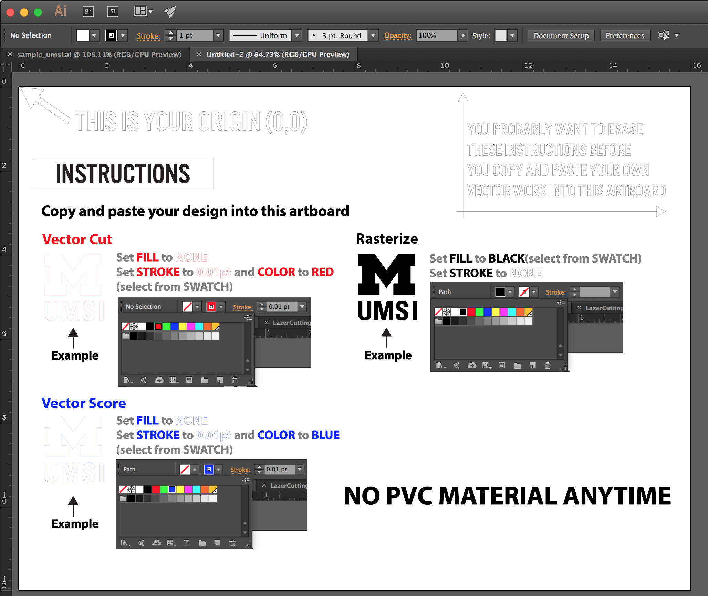
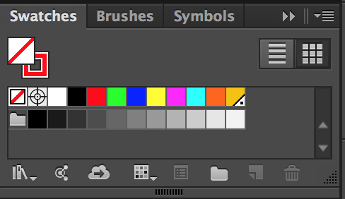
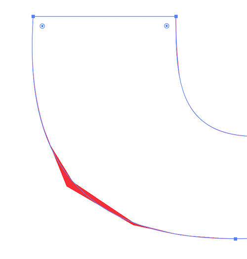

# Laser Cutter Tutorial

## Important Notes
1. You need to attend the **LASER CUTTER TRAINING** before you are elligible to operate the laser cutter
2. Must be **PRESENT** and **MOTIONR** the laser cutter when it is on
3. **STOP** the machine (open the lid) when your material is **ON FIRE**. The fire can burn the optical lens which will cost at least $300.
4. **OPEN** the fume extractor **BEFORE** you run the laser cutting job

## Prepare Your Files
### 1. General Rules
The Universal Laser Cutter use **Color** and **Line Width** to identify different type of cutting.

**BLACK** for RASTERIZE  
**RED LINE** for VECTOR CUT  
**BLUE LINE** for VECTOR SCORE  

In the image above, the Block M is **RASTERIZE**, UMSI is **VECTOR SCORE**, and the border of the block wood is **VECTOR CUT**

For Vector Cut and Vectore Score, choose the **THINNEST** poosible line

### 2. 1-Touch Laser Photo - Rasterize a Photo
To **RASTERIZE** a photo, you can use the application **1-Touch Laser Photo**, which is installed on the Laser Cutter Computer.

### 3. Illustrator
**Illustrator Template File** [**(Download)**](LaserInfo/VLS230.ait)  
The template file contains most of the information you need.

--
#### Cutting Area
The artboard is the laser cutter's cutting area (**16"x12"**, landscape). Please don't modified the artboard size. 
--
#### Color Code
The swatches provides the color that the Laser Cutter can read. You will only need:  
**BLACK** for **RASTERIZE**  
**RED** for **VECTOR CUT**  
**BLUE** for **VECTOR SCORE**

--
#### Sroke
#####!!!ATTENTION!!! Set STROKE to 0.01pt for VECTOR OPERATION
To make the Laser Cutter do VECTOR OPERATION, you will need to set the stroke to 0.01pt, any value other than 0.01pt will make the Laser Cutter do RASTERIZING CUT.

--
#####!!!ATTENTION!!! Weired Illustrator Rendering
When you set the stroke to 0.01pt, Illustrator might have weired rendering result. For example, the image below shows weired polygon around a smooth corner. That is fine, the laser cutter will still following the outline, not the weired polygone part.

--
#### Save Your File
To print your file, save it as PDF and trasfer it to the laser cutter computer via USB thumb drive. Read [Cutting Your File](#cutting_your_file) for more detail.

--
###  4. Inkscape
Coming Soon
### 5. Rhino
Coming Soon

## Prepare Your Materials

## Cutting Your File
### Hardware
### Software

## Cleaning
## Calibration
## Safety

