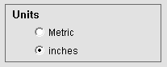
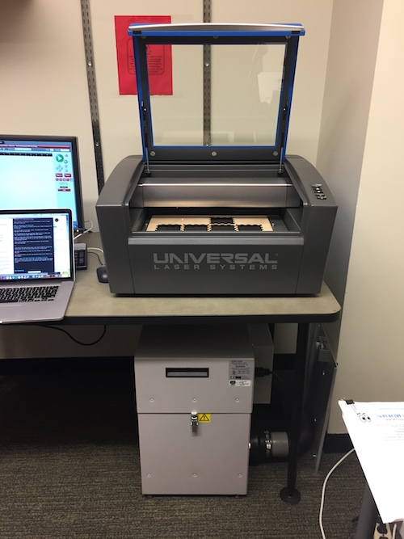

# Laser Cutter Tutorial

## Important Notes
1. You need to attend the **LASER CUTTER TRAINING** before you are eligible to operate the laser cutter
2. Must be **PRESENT** and **MONITOR** the laser cutter when it is on
3. **STOP** the machine (open the lid) when your material is **ON FIRE**. The fire can burn the optical lens which will cost at least $300.
4. **OPEN** the fume extractor **BEFORE** you run the laser cutting job

## Prepare Your Files
### 1. General Rules
The Universal Laser Cutter use **Color** and **Line Width** to identify different type of cutting.

**BLACK** for RASTERIZE  
**RED LINE** for VECTOR CUT  
**BLUE LINE** for VECTOR SCORE  

  
In the image above, the Block M is **RASTERIZE**, UMSI is **VECTOR SCORE**, and the border of the block wood is **VECTOR CUT**

For Vector Cut and Vector Score, choose the **THINNEST** possible line

### 2. 1-Touch Laser Photo - Rasterize a Photo
To **RASTERIZE** a photo, you can use the application **1-Touch Laser Photo**, which is installed on the Laser Cutter Computer.

### 3. Illustrator
**Illustrator Template File** [**(Download)**](LaserInfo/VLS230.ait)  
The template file contains most of the information you need.

--
#### Cutting Area
The artboard is the laser cutter's cutting area (**16"x12"**, landscape). Please don't modified the artboard size. 

--
#### Color Code
The swatches provides the color that the Laser Cutter can read. You will only need:  
**BLACK** for **RASTERIZE**  
**RED** for **VECTOR CUT**  
**BLUE** for **VECTOR SCORE**  

--
#### Stroke
#####!!!ATTENTION!!! Set STROKE to 0.01pt for VECTOR OPERATION
To make the Laser Cutter do VECTOR OPERATION, you will need to set the stroke to 0.01pt, any value other than 0.01pt will make the Laser Cutter do RASTERIZE CUT.

--
#####!!!ATTENTION!!! Weird Illustrator Rendering
When you set the stroke to 0.01pt, Illustrator might have weird rendering result. For example, the image below shows weird polygon around a smooth corner. That is fine, the laser cutter will still following the outline, not the weird polygon part.

--
#### Save Your File
To print your file, save it as PDF and transfer it to the laser cutter computer via USB thumb drive. Read [Cutting Your File](#cutting_your_file) for more detail.

--
###  4. Inkscape
Coming Soon
### 5. Rhino
Coming Soon

## Prepare Your Materials

## Cutting Your File
### 1. Turn on the computer
Turn the computer and wait until you login to the laser-cutter user account

### 2. Open the UCP control program
Double click the UCP app icon on the desktop.  
  
It will open this program  

The power button on the top right corner should be **RED**. If it is gray, please reconnect the USB cable, close the program, and open it again.

### 3. Power up the laser cutter
You need to first power up the computer to turn on the laser cutter because part of the power the laser cutter consume comes from the computer.

There are two ways to power up the laser cutter
#### 1. Use the dedicated power button on the machine

#### 2. Use the power button on the software

During the powering up, you will hear the gear moving noise from the machine. It is the laser cutter trying to initialize and self-calibrate. Please wait until the noise stop, and the bottom left corner of UCP turn from **Initializing** to **Idle**  
   
If the calibration sound from the laser cutter stops, but the UCP program is still not in Idle mode. Close the program and reopen it again.

At this moment, the big green play button should be active.  

**!!!IMPORTANT!!!: DO NOT CLICK ON THE PLAY BUTTON YET**

### 4. Prepare to print your file
#### 1. Open your PDF file in Adobe Reader
In Adobe Reader, Click File/Print  

#### 2. Adjust the Printer Settings
In the Adobe Reader's Print Dialog Box, Select printer **VLS2.30**  

After choosing the printer, click **Properties**, it will bring up the setting window like this.  

Select the material you are cutting under **Material Database** tab. In this example, the Birch plywood is under Natural/Wood/Medium Wood/Birch  

On the right-hand side, you can adjust the laser power.  
**!!!IMPORTANT!!!:  
Always do a test cutting before proceeding any major task. The default setting might not suit your needs. A test cutting can prevent from causing serious danger and wasting material.**  
  

Enter the correct material thickness. You can use the caliber in the Studio.  
**!!!IMPORTANT!!!:  
Always measures your material before cutting. The stock specs might be different from the actual material.**  

Choose the units you are using. It should be inches if you are using the template we provide.  

Other settings should remain unchanged.  
Click **Apply** to apply your changes, and click **OK** to close the window.  

In the printer window, make sure the page sizing is set to **Actual size**.

Press **Print** to send your file to UCP program. It won't trigger the laser cutter yet.

### 5. Adjusting the Position  
Go back to UCP program. You should now see your design showing on the preview area.  

Lift up the door of the laser cutter. You should see a red dot showing on the cutting table.  

Put your material on the cutting table. Make sure it is level and flat. The uneven material might damage the laser cutter.  

Switch to focus view on UCP. Left click on the cutting area. A blue anchor point will show up. The red dot in the laser cutter will move to the corresponding location.  

Click on the relocate view to move your design. You can either:  
Left click and drag.

or 

Click one of the nine anchor points, and click "To Pointer" to move the anchor point to the blue anchor point we set previously in focus view.

Use these two features to make sure your design can fit into your material.
**!!!IMPORTANT!!!: Wherever there is a design on the cutting area, your material should cover it. Never that the laser hit the cutting table directly.**

The **Estimate View** can tell you how much time it will take to cut your design.  

### 6. Open the Fume Extractor and Ready to Print
Before running any laser cutter job, you will need to open the **fume extractor**. The fume extractor is located right underneath the laser cutter.

The power of the fume extractor is located on the **right-hand side**. Open the power and you should hear a very loud noise.

Once the fume extractor is running, double check all of your settings, and you should ready to go.

Close the door. And you can hit the Green button to Start running your laser-cutting job.

### 7. !!!IMPORTANT!!! Safety
1. Stop the laser-cutting job when there is smoke in the chamber
2. Stop the laser-cutting job when the flame is too large
3. Never let the laser beam cut directly on the honeycomb
4. Keep an eye on the laser cutter all the time

### 8. Clean Up and Turn off the Machine.
When you finish your cutting. You need to

1. Turn off the fume extractor  
2. Remove all of the material that is left on the cutting table  
3. Close the door of laser cutter  
4. Turn off the laser cutter
5. Log off the computer

